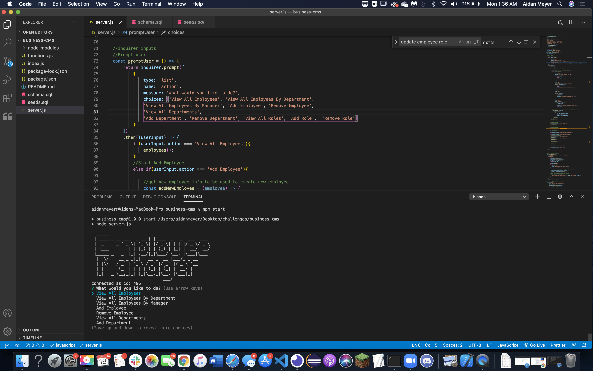

# business-cms

## Description 
This is a sql database designed to make managing employees easier using inquirer

## Installation
clone the repository and run npm i to install all the dependancies 
## Usage
Using mysql source the schema.sql file and the seeds.sql file.  Then run npm start to begin

## Contact
[Github](https://github.com/XXLZopes)

You can reach out to me by email at afordm99@gmail.com
